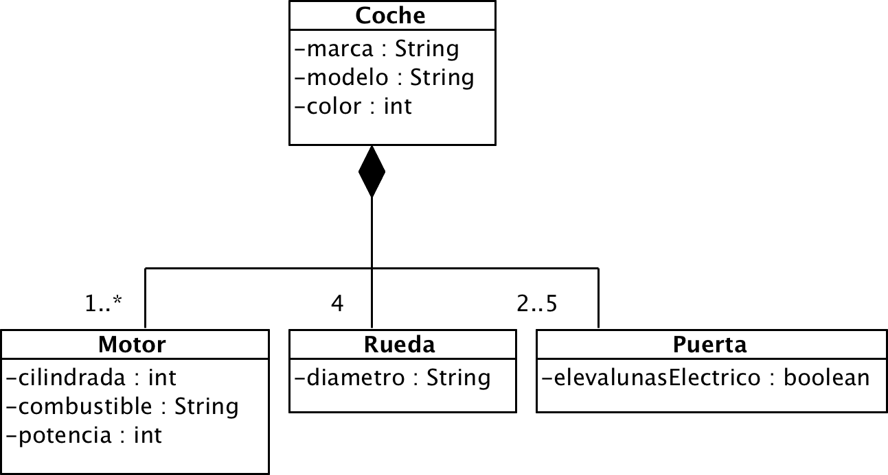
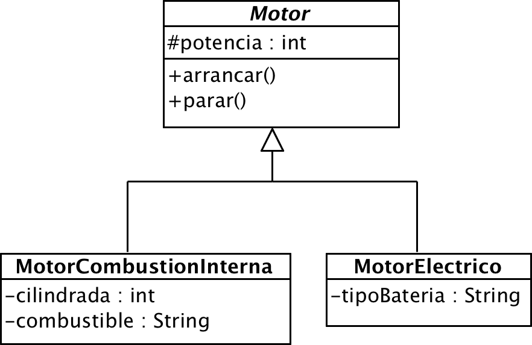

# Ejercicio 17 - Coche

Queremos modelar un coche y ya disponemos de este diagrama de clases:

El departamento de ingeniería ha perfeccionado nuestros sistemas de propulsión añadiendo motores eléctricos para mejorar la eficiencia, creando coches híbridos:

Siguiendo los diagramas, crea los objetos necesarios junto con sus relaciones, introduciendo los datos mediante inicializadores.

Demuestra el funcionamiento creando una instancia de cada tipo de coche (normal o híbrido). 
