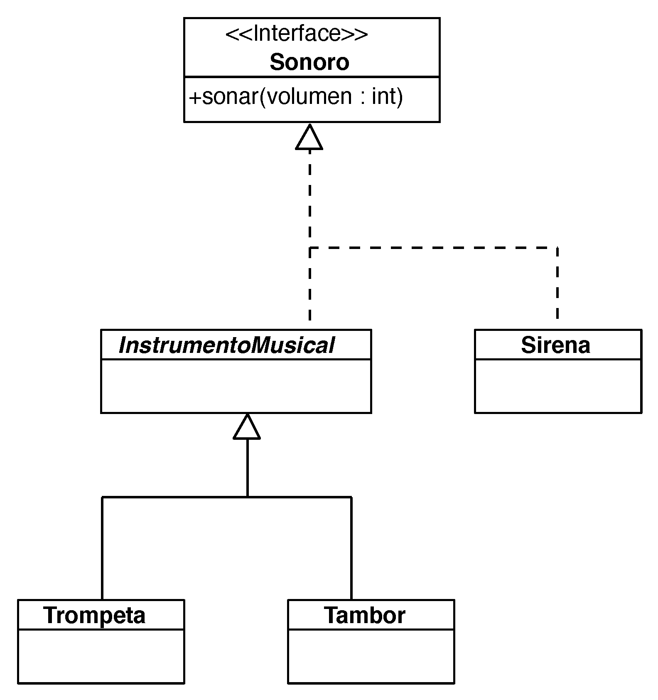

# Ejercicio 18 - Sonoro

Modela esta jerarquía de clases, utilizando protocolos, extensiones y la herencia donde convenga.

Crea, por lo menos, un objeto de cada tipo y añade inicializadores que muestren en consola un mensaje cuando el objeto se instancie.
