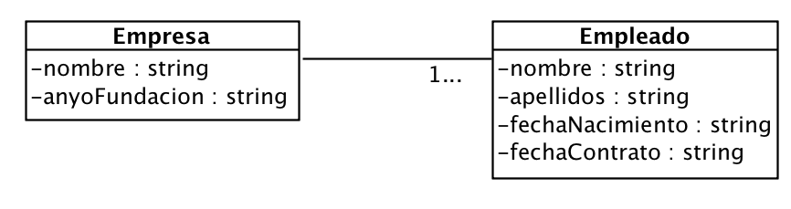

# Ejercicio 19 - Empresas y empleados

Queremos construir una aplicación que permita almacenar la información relevante sobre empresas y sus empleados, tal como aparecen en el siguiente diagrama de clases:

El programa creará los objetos necesarios para demostrar la siguiente funcionalidad:

1. Crear una nueva empresa.
2. Añadir empleado a una empresa ya existente.
3. Mostrar una empresa y sus empleados.

> NOTA: Utilizar protocolos, extensiones y la herencia donde convenga.
