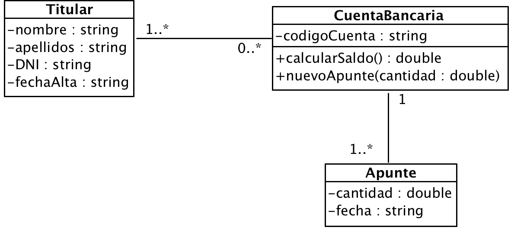

# Ejercicio 20 - Cuenta bancaria

Queremos construir una aplicación que nos permita gestionar información sobre cuentas bancarias, tal como aparecen en el siguiente diagrama de clases:

El programa creará los objetos necesarios para demostrar la siguiente funcionalidad:

1. Nuevo titular
2. Nueva cuenta
3. Nuevo apunte en cuenta
4. Borrar una cuenta
5. Mostrar el saldo de todas las cuentas de un titular

> NOTA: El saldo de la cuenta será una propiedad calculada
